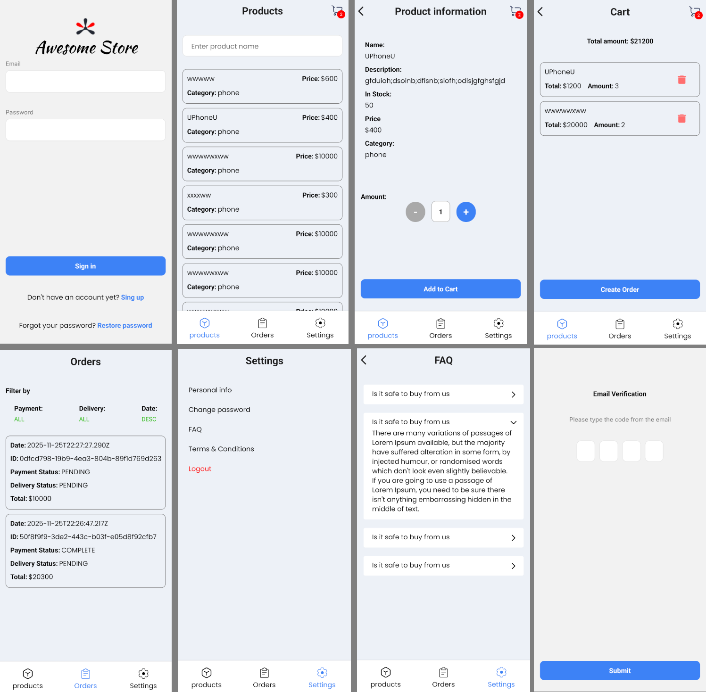

# Camp Project - Awesome-Store

This mobile app is result of 2 week long camp, where i've been following technical documentation and design, while being coordinated by mentor. It features React Native, Nest.js, PrismaDB, PostrgeSQL...

Backend utilizes most of main features of Nest.js, so it reads simply and clearly.

Frontend is React Native on Expo. And React-navigation is used for routing.

